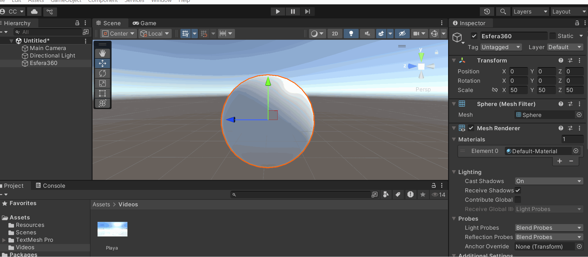

# 🧪 Visualización de Imágenes y Video 360° en Unity

## 📅 Fecha
`2025-05-26` – Fecha de entrega 

---

## 🎯 (Parte 1) Descripción de cómo se integró imagen y video 360°.

Aunque se intentó seguir el tutorial del taller, no conseguí rotar la escala de la esfera para poder verla desde adentro modificando x = -1. Al llegar a ese punto, se optó por modificarla mediante código, el cual se mostrará más adelante. El taller se centró en Unity.

---
🏅 Para la imagen 360, primero buscamos una de estas imágenes en la web. Se creó una esfera con escala (5, 5, 5) en la posición inicial (0, 0, 0), donde también se colocó la cámara principal. Se optó por invertir las caras mediante código, utilizando el script InverSphereFaces. Al añadir este componente a la esfera e inspeccionarla, en el componente del script aparece un campo para arrastrar y soltar la imagen que se desea usar en la esfera.

---
🏅 Para el video, se realizó un procedimiento similar al anterior, pero esta vez con el script Video360Player. De igual manera, en el script se dejó la ruta de la carpeta que contendría el video. Al añadir el script a la esfera, solo se requiere ingresar el nombre del video, que en este caso se llamaba "playa".

---

## 🧠 (Parte 2) Capturas o gifs desde el punto de vista dentro de la esfera.

> ✅ Primero mostraremos la imagen 360.


> ✅ Segundo, mostraremos el video 360. Como es un video de una playa, el cambio no es drástico, pero podrán notar el movimiento de las olas y las nubes a lo largo del tiempo, lo que confirma que se trata de un video.



---
## 🔧 (Parte 3) Código relevante explicado.

Creo que lo más relevante, o lo que más me costó, fue la parte de invertir las caras de la esfera. El siguiente código es el que realiza esta función:

```c#
// Invierte las normales y los triángulos de una malla para visualizar objetos desde su interior
// (Útil para esferas 360 en Unity)
void InvertSphereNormals()
{
    // 1. Obtener el componente MeshFilter de la esfera
    MeshFilter meshFilter = sphere.GetComponent<MeshFilter>();
    
    // Validar si existe el MeshFilter
    if (meshFilter == null) 
    {
        Debug.LogWarning("No se encontró MeshFilter en el objeto esfera");
        return; // Salir si no hay MeshFilter
    }

    // 2. Obtener la malla (Mesh) del objeto
    Mesh mesh = meshFilter.mesh;

    // 3. Invertir las normales (para que las caras sean visibles desde adentro)
    Vector3[] normals = mesh.normals; // Obtener array de normales
    
    // Recorrer y invertir cada normal (multiplicar por -1)
    for (int i = 0; i < normals.Length; i++)
    {
        normals[i] = -normals[i];
    }
    mesh.normals = normals; // Aplicar cambios

    // 4. Invertir el orden de los triángulos (para corregir el renderizado)
    int[] triangles = mesh.triangles; // Obtener array de triángulos
    
    // Recorrer en grupos de 3 (cada triángulo)
    for (int i = 0; i < triangles.Length; i += 3)
    {
        // Intercambiar primer y tercer índice del triángulo
        int temp = triangles[i];
        triangles[i] = triangles[i + 2];
        triangles[i + 2] = temp;
    }
    mesh.triangles = triangles; // Aplicar cambios

    // Opcional: Recalcular normales para asegurar consistencia
    mesh.RecalculateNormals();

    // Opcional: Recalcular límites del mesh para colisiones/renderizado
    mesh.RecalculateBounds();

    Debug.Log("Normales y triángulos invertidos correctamente");
}
```
Tanto la imagen como el video se cargaron mediante código, utilizando las herramientas y guías proporcionadas en las instrucciones del taller. 

---

## 📁 (Parte 4) Enlace a referencias o bibliografía usada.

El siguiente video ayuda a una rápida implementación, pero hay que pausarlo con frecuencia porque no explica los detalles con profundidad

- https://www.youtube.com/watch?v=1Fupk75GhHg