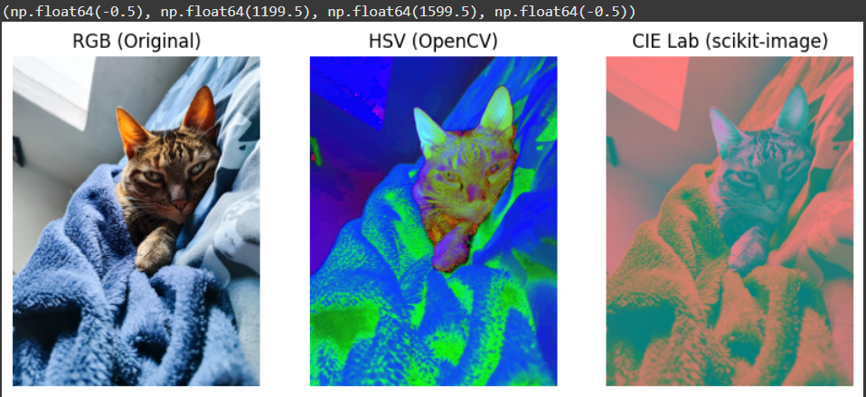
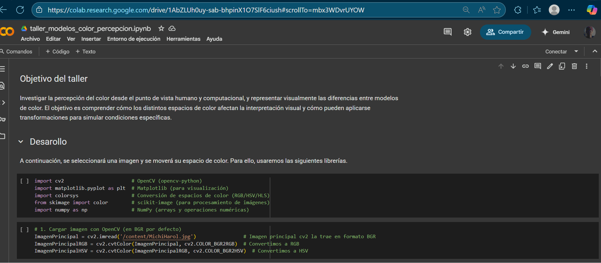
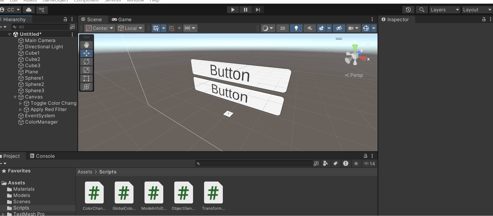

# 🧪 Explorando el Color: Percepción Humana y Modelos Computacionales

## 📅 Fecha
`2025-05-26` – Fecha de entrega 

---

## 🎯 (Parte 1) Explicación de los modelos de color utilizados.

1. Modelo RGB (Red, Green, Blue) Es un modelo aditivo basado en la combinación de tres colores primarios: rojo (Red), verde (Green) y azul (Blue).
Los colores se generan sumando diferentes intensidades de luz roja, verde y azul.Cada componente (R, G, B) varía entre 0 y 255 (en sistemas de 8 bits) o en valores normalizados entre 0 y 1.
2. Modelo HSV (Hue, Saturation, Value) También llamado HSB (Hue, Saturation, Brightness), este modelo organiza los colores en tres componentes:H (Matiz): El tipo de color (ej: rojo, azul), representado como un ángulo en un círculo cromático (0° a 360°). S (Saturación): Intensidad del color (0% = gris, 100% = color puro). V (Valor o Brillo): Luminosidad (0% = negro, 100% = color máximo).
3. Modelo CIE Lab (L*a*b*) Desarrollado por la CIE (Commission Internationale de l'Éclairage), es un modelo independiente del dispositivo y perceptualmente uniforme.
Componentes:L (Luminancia): Brillo (0 = negro, 100 = blanco).
a: Eje verde-rojo (valores negativos = verde, positivos = rojo).b: Eje azul-amarillo (valores negativos = azul, positivos = amarillo).

---

## 🧠 (Parte 2) Comparación visual clara entre RGB, HSV y CIE Lab.

Comparativa clara de los formatos



---

## 🔧 (Parte 3) GIFs animados mostrando las simulaciones.

> ✅ Se muestra el colab con los distintos ejercicios pedidos.



> ✅ Se muestra el uso de cambio de color en unity 



---

## 📁 (Parte 4) Código relevante o enlaces al notebook/script/escena.

Daltonismo (protanopía, deuteranopía) con funciones de simulación o manipulación de matrices de color.

```python
# Simular protanopía (reducir canal a)
img_lab_protanopia = ImagenPrincipalLab.copy()
img_lab_protanopia[:, :, 1] *= 0.3  # Reducir información verde-rojo

# Simular deuteranopía (reducir canal a y ajustar b)
img_lab_deuteranopia = ImagenPrincipalLab.copy()
img_lab_deuteranopia[:, :, 1] *= 0.1
img_lab_deuteranopia[:, :, 2] *= 0.5

# Convertir de vuelta a RGB
img_protanopia_lab = color.lab2rgb(img_lab_protanopia)
img_deuteranopia_lab = color.lab2rgb(img_lab_deuteranopia)

# Mostrar resultados
plt.figure(figsize=(10, 12))
plt.subplot(131), plt.imshow(ImagenPrincipalRGB), plt.title('Original (RGB)')
plt.subplot(132), plt.imshow(img_protanopia_lab), plt.title('Protanopía (Lab)')
plt.subplot(133), plt.imshow(img_deuteranopia_lab), plt.title('Deuteranopía (Lab)')
plt.show()
```

Reducción de brillo o contraste para simular entornos de baja luz.

```python
# Reducir brillo (canal V)
img_hsv_low_light = ImagenPrincipalHSV.copy()
img_hsv_low_light[:, :, 2] = img_hsv_low_light[:, :, 2] * 0.2  # Reducir a 20%

# Reducir contraste (canal S)
img_hsv_low_light[:, :, 1] = img_hsv_low_light[:, :, 1] * 0.2  # Reducir saturación

# Convertir de vuelta a RGB
img_low_light = cv2.cvtColor(img_hsv_low_light, cv2.COLOR_HSV2RGB)

# Mostrar resultados
plt.figure(figsize=(10, 12))
plt.subplot(121), plt.imshow(ImagenPrincipalRGB), plt.title('Original (RGB)')
plt.subplot(122), plt.imshow(img_low_light), plt.title('Baja Luz (HSV)')
plt.show()
```

---

## 🧪 (Parte 5) Descripción general de los prompts usados

Realmente use mas la ia para la parte de Unity sobre todo para el script sobre cambiar el color 

## 📊 (Parte 6) Reflexión sobre el impacto visual de las simulaciones y diferencias de percepción.

Me gustó la idea de usar diferentes formatos de color para simular ciertos efectos, como un panorama más oscuro o el tono sepia. Primero, convertir la imagen a RGB, luego transformarla a un formato que permita modificar fácilmente los parámetros deseados (como HSV o CIE Lab), ajustar los valores necesarios y finalmente volver a RGB. ¡Me pareció una solución muy interesante!