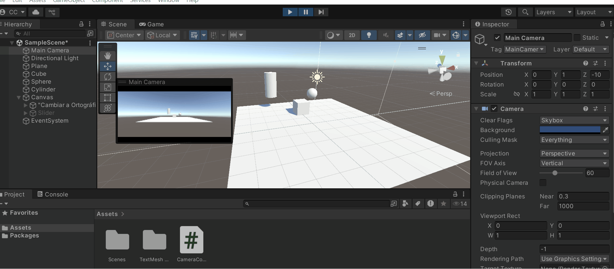

# 🧪 Proyecciones 3D: Cómo ve una Cámara Virtual

## 📅 Fecha
`2025-05-26` – Fecha de entrega 

---

## 🎯 Explicación de los conceptos de proyección en perspectiva y ortográfica.

Proyección en Perspectiva: Este método simula cómo el ojo humano percibe la profundidad, haciendo que los objetos lejanos aparezcan más pequeños y las líneas paralelas converjan en un punto de fuga. Es esencial en aplicaciones que buscan realismo, como videojuegos, animación 3D y renders arquitectónicos. Matemáticamente, divide las coordenadas 3D entre su distancia a la cámara (z), creando una sensación de profundidad. Por ejemplo, en un juego, un personaje que se aleja disminuye de tamaño gradualmente, replicando la perspectiva natural.

Proyección Ortográfica: A diferencia de la perspectiva, esta proyección ignora la distancia, manteniendo el tamaño constante sin distorsión. Las líneas paralelas permanecen paralelas, lo que la hace ideal para planos técnicos, diseño CAD y pixel art. Aquí, las coordenadas 3D se proyectan directamente en 2D (
x′= x, y′= y x′=x,y′=y), descartando z(aunque se usa para ordenar capas). Por ejemplo, en un plano de ingeniería, todas las vistas (frontal, lateral) conservan las proporciones exactas, sin importar su posición en el espacio.

Ambas técnicas son fundamentales en gráficos por computadora, pero su elección depende del equilibrio entre realismo y precisión geométrica requerida.

---

## 🧠 GIFs animados de los efectos al mover la cámara.

> ✅ A continuacion podemos ver el cambio de camara que se implemento en Unity



---

## 🔧 Código relevante o enlaces a escena/visualizador.

Se presenta el codigo que se uso para el manejo de la camara

```C#
// Controlador de cámara que maneja la alternancia entre proyección ortográfica/perspectiva
public class CameraController : MonoBehaviour
{
    // Referencias a los componentes
    public Camera mainCamera;            // Cámara principal a controlar
    public Slider orthoSizeSlider;       // Slider para ajustar tamaño ortográfico
    public Button toggleButton;          // Botón para alternar entre modos

    private bool isOrthographic = false;  // Estado actual de la proyección

    void Start()
    {
        // Configuración inicial:
        // 1. Asigna el método ToggleProjection al evento click del botón
        toggleButton.onClick.AddListener(ToggleProjection);
        
        // 2. Asigna el método ChangeOrthoSize al cambio de valor del slider
        orthoSizeSlider.onValueChanged.AddListener(ChangeOrthoSize);

        // 3. Inicializa el estado de la cámara
        UpdateCamera();
    }

    // Alterna entre proyección ortográfica y en perspectiva
    void ToggleProjection()
    {
        // Cambia el estado actual
        isOrthographic = !isOrthographic;
        
        // Actualiza la cámara con el nuevo estado
        UpdateCamera();
    }

    // Ajusta el tamaño ortográfico cuando se mueve el slider
    void ChangeOrthoSize(float size)
    {
        // Solo aplica cambios si estamos en modo ortográfico
        if (isOrthographic)
        {
            mainCamera.orthographicSize = size;
        }
    }

    // Actualiza todos los elementos visuales según el modo actual
    void UpdateCamera()
    {
        // 1. Aplica el tipo de proyección a la cámara
        mainCamera.orthographic = isOrthographic;
        
        // 2. Muestra/oculta el slider según el modo
        orthoSizeSlider.gameObject.SetActive(isOrthographic);

        if (isOrthographic)
        {
            // Configuración para modo ortográfico:
            // - Cambia el texto del botón
            // - Aplica el valor actual del slider al tamaño ortográfico
            toggleButton.GetComponentInChildren<Text>().text = "Cambiar a Perspectiva";
            mainCamera.orthographicSize = orthoSizeSlider.value;
        }
        else
        {
            // Configuración para modo perspectiva:
            // - Cambia el texto del botón
            toggleButton.GetComponentInChildren<Text>().text = "Cambiar a Ortográfica";
        }
    }
}
```

---

## 📁 Descripción general de los prompts usados

Este análisis exploró el control programático de cámaras en Unity, abarcando desde los fundamentos teóricos (proyecciones ortográfica/perspectiva) hasta su implementación práctica mediante la API del motor. Se demostró cómo gestionar dinámicamente parámetros como orthographicSize y alternar entre modos de renderizado, integrando además interfaces de usuario interactivas para una manipulación intuitiva.

Esencia técnica:

- Manejo de proyecciones mediante código

- Integración UI/parámetros de cámara

---

## 🧪 Reflexión sobre cómo la cámara transforma la escena desde una matriz 4x4 hasta la imagen final.

imagina que tu escena 3D es un teatro: los objetos son actores en un escenario infinito. La cámara es el director que decide qué parte de esta obra verás. La magia ocurre en 4 pasos ocultos:

La Matriz 4x4: El Lenguaje Secreto del Espacio

Es como un traductor que convierte las posiciones de los objetos (en X,Y,Z) a un nuevo "idioma" relativo a la cámara.

Cada número en la matriz ayuda a:

🔹Rotar el mundo para que la cámara siempre mire "hacia adelante"
🔹Aplanar la profundidad (perspectiva) o mantenerla rígida (ortográfica)
🔹Recortar lo invisible (como lo que queda detrás de la cámara)

