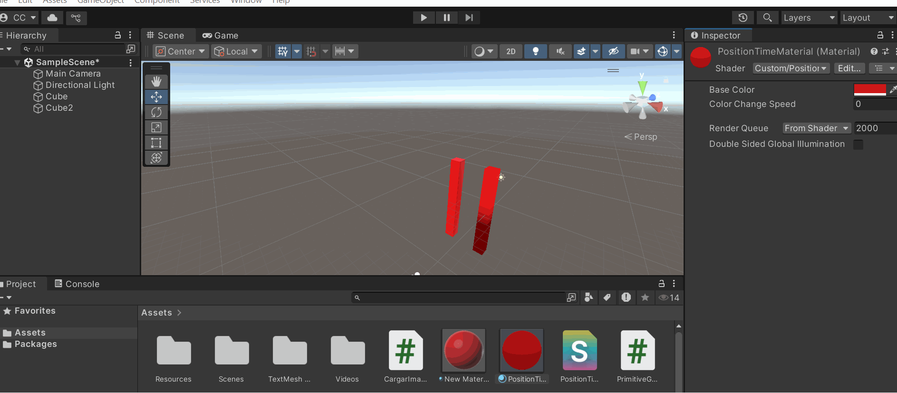

# 🧪 Sombras Personalizadas: Primeros Shaders en Unity

## 📅 Fecha
`2025-05-26` – Fecha de entrega 

---

## 🎯 Explicación breve de qué es un shader y para qué sirve.

Un Shader es un pequeño programa que le dice a la GPU (tarjeta gráfica) cómo dibujar cada píxel o vértice de un objeto en pantalla. Controla aspectos como:

- Color (texturas, iluminación, transparencia).

- Geometría (deformaciones, animaciones).

- Efectos visuales (reflejos, sombras, niebla).

---

## 🧠 GIFs animados

Para ver mas claramente esto se colocan dos objetos 3d juntos uno tiene los shader modificados y el otro no 



---

## 🔧 Código relevante

```C#
Shader "Custom/PositionTimeShader"
{
    // ========== PROPIEDADES EDITABLES EN EL INSPECTOR ==========
    Properties
    {
        // Color base del objeto
        _BaseColor ("Base Color", Color) = (1,1,1,1)
        // Velocidad de cambio del efecto temporal
        _Speed ("Color Change Speed", Float) = 1.0
    }

    SubShader
    {
        // Configuración básica de renderizado
        Tags { "RenderType"="Opaque" } // Shader para objetos opacos
        LOD 100 // Nivel de detalle (Level Of Detail)

        Pass
        {
            CGPROGRAM
            // Declaración de funciones shader
            #pragma vertex vert // Función para procesar vértices
            #pragma fragment frag // Función para procesar píxeles
            
            // Incluye funciones esenciales de Unity
            #include "UnityCG.cginc"

            // ========== ESTRUCTURAS DE DATOS ==========
            // Datos de entrada del vértice (CPU -> GPU)
            struct appdata
            {
                float4 vertex : POSITION; // Posición local del vértice
            };

            // Datos interpolados entre vértices (Vertex -> Fragment shader)
            struct v2f
            {
                float4 vertex : SV_POSITION; // Posición en pantalla
                float3 worldPos : TEXCOORD0; // Posición en coordenadas mundiales
            };

            // ========== VARIABLES GLOBALES ==========
            fixed4 _BaseColor; // Color definido en Properties
            float _Speed; // Velocidad definida en Properties

            // ========== VERTEX SHADER ==========
            v2f vert (appdata v)
            {
                v2f o;
                // Transforma la posición local a coordenadas de pantalla
                o.vertex = UnityObjectToClipPos(v.vertex);
                // Convierte la posición local a coordenadas mundiales
                o.worldPos = mul(unity_ObjectToWorld, v.vertex).xyz;
                return o;
            }
            
            // ========== FRAGMENT SHADER ==========
            fixed4 frag (v2f i) : SV_Target
            {
                // Crea un gradiente vertical basado en la posición Y del mundo
                // saturate() limita el valor entre 0 y 1
                float verticalGradient = saturate(i.worldPos.y * 0.5 + 0.5);
                
                // Crea un componente que oscila con el tiempo usando seno
                // _Time.y es el tiempo desde el inicio en segundos
                float timeComponent = sin(_Time.y * _Speed) * 0.5 + 0.5;
                
                // Combina los efectos:
                fixed4 col = _BaseColor; // Color base
                col.rgb *= verticalGradient; // Aplica gradiente vertical
                col.r += timeComponent * 0.3; // Añade variación temporal al canal rojo
                
                return col; // Devuelve el color final del píxel
            }
            ENDCG
        }
    }
}
```

---

## 📊 Reflexión personal: ¿qué aprendiste al modificar el shader?, ¿cómo cambió el aspecto visual?

"¡Vaya sorpresa me llevé con los shaders! Pensaba que solo servían para poner texturas simples o optimizar el rendimiento del juego – eso de 'ahorrar FPS' y poco más. Más allá de los típicos efectos de luces y partículas, descubrí que los shaders pueden distorsionar realidades, crear hologramas vibrantes, simular agua que fluye e incluso hacer que los objetos 'respiren' con vida propia.
