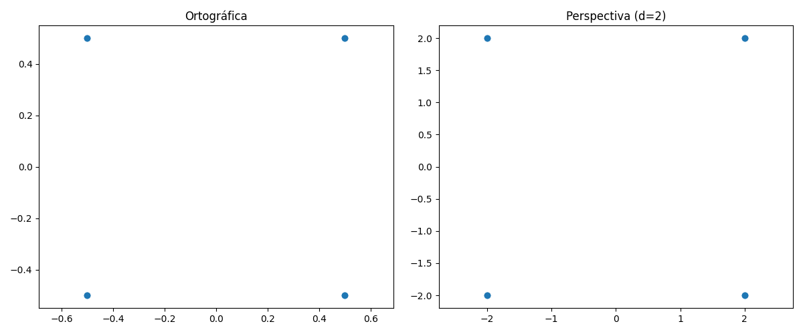
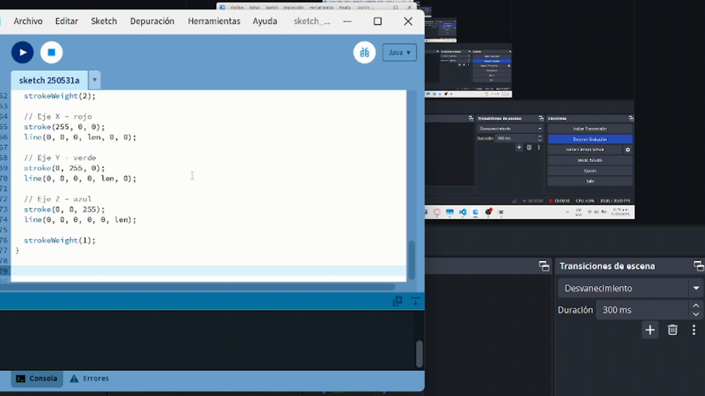
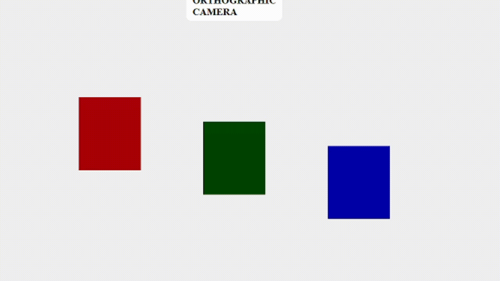

# Taller 17 - Espacios Proyectivos y Matrices de Proyección

📅 Fecha: 2025-05-28  
🎓 Curso: Computación Visual  
🎯 Tema: Geometría proyectiva y matrices de proyección en gráficos 3D

---

## 🔍 Objetivo

Comprender y aplicar los conceptos fundamentales de geometría proyectiva y el uso de matrices de proyección para representar escenas tridimensionales en un plano bidimensional. Este conocimiento es base esencial del pipeline gráfico moderno.

---

## 📘 Contenidos Clave

- Espacios proyectivos y coordenadas homogéneas.
- Diferencias entre geometría euclidiana, afín y proyectiva.
- Matrices de proyección ortogonal y perspectiva.
- Simulación de cámaras gráficas en diferentes entornos.

---

## 📁 Estructura de Carpetas

2025-05-28_taller_espacios_proyectivos/
├── python/
├── processing/
├── threejs/
└── README.md

---

## 🧪 Actividades por Entorno

---

### 1. 💻 Python – Visualización y Cálculo de Proyecciones

**Descripción:**
- Representación de puntos en coordenadas homogéneas.
- Aplicación de matrices de proyección ortogonal y perspectiva.
- Visualización del efecto de la distancia focal.

**Visualización:**

📸  

---

### 2. 🎨 Processing – Simulación de Cámaras

**Descripción:**
- Escena 3D con cubos posicionados a lo largo del eje Z.
- Alternancia entre `perspective()` y `ortho()` con tecla 'C'.
- Control de navegación con `peasycam`.

**Visualización:**

📸  

---

### 3. 🌐 Three.js con React Three Fiber – Cámaras Interactivas

**Descripción:**
- Escena con objetos a distintas profundidades.
- Alternancia interactiva entre cámara ortográfica y perspectiva.
- Control de vista con `OrbitControls`.

**Visualización:**

📸  

---

## 🧠 Conclusiones

- La proyección ortográfica conserva tamaños, pero pierde profundidad visual.
- La perspectiva emula la visión humana, mostrando objetos lejanos más pequeños.
- Las coordenadas homogéneas y las matrices permiten transformar el espacio 3D al plano 2D de forma precisa.
- El tipo de cámara influye significativamente en la percepción espacial de una escena.

