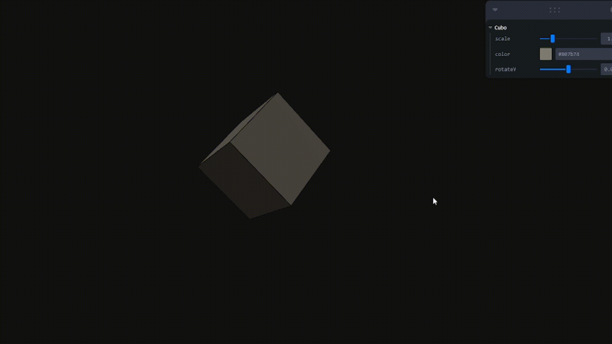

# Taller - Interacción con un Cubo 3D en React Three Fiber

Este proyecto fue desarrollado como parte del Taller 16 de Computación Visual, con el objetivo de implementar un objeto 3D interactivo controlado por el usuario mediante entradas gráficas y de hardware.

## 🎯 Objetivo

- Crear un cubo 3D utilizando React Three Fiber.
- Controlar su escala, rotación y color mediante una interfaz gráfica (Leva).
- Visualizar el cubo en toda la pantalla.
- Mejorar su percepción visual agregando líneas de borde (wireframe).

## 🧱 Tecnologías

- [React Three Fiber](https://docs.pmnd.rs/react-three-fiber/)
- [Leva](https://github.com/pmndrs/leva)
- [Three.js](https://threejs.org/)
- [Vite](https://vitejs.dev/) (entorno de desarrollo)

## 🖥️ Interfaz

GIF de la interacción con el cubo:



> 💡 Este GIF debe capturar el cambio de color, rotación y escala del cubo con la interfaz de Leva.

## 🧠 Aprendizajes

- Uso de `Canvas` para representar escenas en 3D.
- Control de cámara con `OrbitControls`.
- Implementación de UI con Leva para manipular objetos 3D.
- Estilización y posicionamiento para ocupar el `viewport` completo.
- Añadir bordes para mejorar la visualización espacial de los objetos.

## 🚀 Instrucciones para correr el proyecto

```bash
npm install
npm run dev
