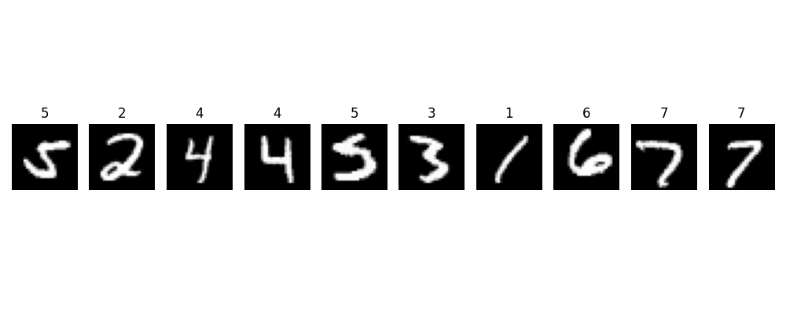

# Taller - Redes Convolucionales desde Cero: Reconocimiento de Imágenes con PyTorch


📅 Fecha  

2025-06-04 – Fecha de asignación

2025-06-23 – Fecha de realización

2025-06-24 – Fecha de entrega


## 🧠 Objetivo
Construir, entrenar y evaluar un modelo de red neuronal convolucional (CNN) desde cero usando PyTorch, aplicándolo sobre el dataset MNIST para clasificación de dígitos escritos a mano.

---

## 📦 Dataset utilizado
**MNIST** – Contiene 60,000 imágenes de entrenamiento y 10,000 de prueba, en escala de grises (28x28 píxeles), con etiquetas del 0 al 9.

---
A continuación se muestra una muestra aleatoria de 10 imágenes del set de entrenamiento:


## 🧱 Arquitectura de la Red CNN

Conv2D (1 → 32 filtros, kernel 3x3) → ReLU → MaxPooling (2x2)
→ Conv2D (32 → 64 filtros, kernel 3x3) → ReLU → MaxPooling (2x2)
→ Flatten → Fully Connected (128 neuronas) → ReLU → Output (10 clases)


## ⚙️ Entrenamiento del modelo

- **Función de pérdida:** `CrossEntropyLoss`
- **Optimizador:** `Adam`
- **Épocas:** *5*
- **Batch size:** 64

### 📈 Curvas de entrenamiento


---

## 🔹 Fragmento de código relevante:

```python
# Función de pérdida y optimizador
criterion = nn.CrossEntropyLoss()
optimizer = optim.Adam(model.parameters(), lr=0.001)

# Entrenamiento
num_epochs = 5
train_losses = []
train_accuracies = []

for epoch in range(num_epochs):
    running_loss = 0.0
    correct = 0
    total = 0

    for images, labels in train_loader:
        images, labels = images.to(device), labels.to(device)

        optimizer.zero_grad()
        outputs = model(images)
        loss = criterion(outputs, labels)
        loss.backward()
        optimizer.step()

        running_loss += loss.item()
        _, predicted = torch.max(outputs, 1)
        total += labels.size(0)
        correct += (predicted == labels).sum().item()

    epoch_loss = running_loss / len(train_loader)
    epoch_acc = 100 * correct / total
    train_losses.append(epoch_loss)
    train_accuracies.append(epoch_acc)

    print(f'Epoch {epoch+1}/{num_epochs}, Loss: {epoch_loss:.4f}, Accuracy: {epoch_acc:.2f}%')

```


## 📚 Entrega
```
2025-06-04_taller_cnn_basico_deep_learning_keras_pytorch/
 └── data/MNIST/raw/
 └── keras/
 └── pytorch/
 └── README.md 
```


## 🧪 Evaluación del modelo

-Número de épocas: 5

-Precisión final (train): ≈ 98%

-Tiempo de entrenamiento: unos pocos segundos por época en CPU.


---

## 👥 Integrantes

- Sebastián Muñoz → jumunozle@unal.edu.co
- Carlos Camacho → cacamacho@unal.edu.co  
- Juan Daniel Ramírez → juaramriezmo@unal.edu.co
- Sergio David López → slopezpa@unal.edu.co 


---

## Reflexión

Durante este taller se aprendió cómo las capas convolucionales extraen características espaciales en imágenes y cómo su combinación con funciones de activación y pooling mejora el desempeño del modelo.

Cambios como aumentar filtros o añadir Dropout pueden aumentar precisión o reducir sobreajuste.
