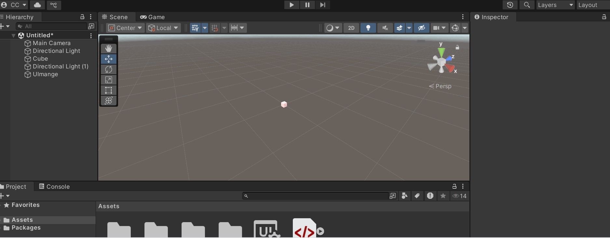

# 🧪 Dashboards Visuales 3D: Sliders y Botones para Controlar Escenas

## 📅 Fecha
2025-06-04 – Fecha de asignación

2025-06-23 – Fecha de realización

2025-06-24 – Fecha de entrega

---

## 🎯 (Parte 1) Breve explicación de los controles creados.
La implementación se realizó completamente en Unity, desarrollando tres controles principales: un botón destinado a activar o desactivar la luz de la escena, un control deslizante (slider) que ajusta dinámicamente la escala del cubo, y un selector de color que modifica automáticamente el color del material aplicado al cubo.


---

## 🧠 (Parte 2) GIFs animados

> ✅ En el siguiente GIF se ve funcioando los diferentes controles.



---

## 🔧 (Parte 3) Código relevante (C#, JSX/GLSL o JS para geometría).

A continuación se muestra el código para los controles  

```C#
using UnityEngine;
using UnityEngine.UIElements;

public class UIController : MonoBehaviour
{
    public GameObject targetObject;
    public Light directionalLight;
    private VisualElement root;
    private Slider scaleSlider;
    private DropdownField colorDropdown;
    private Button toggleButton;
    private Material targetMaterial;

    private bool lightOn = true;

    void Awake()
    {
        root = GetComponent<UIDocument>().rootVisualElement;

        scaleSlider = root.Q<Slider>("scale-slider");
        colorDropdown = root.Q<DropdownField>("color-dropdown");
        toggleButton = root.Q<Button>("toggle-button");

        targetMaterial = targetObject.GetComponent<Renderer>().material;

        scaleSlider.RegisterValueChangedCallback(evt =>
        {
            float scale = evt.newValue;
            targetObject.transform.localScale = new Vector3(scale, scale, scale);
        });

        colorDropdown.choices = new List<string> { "Red", "Green", "Blue" };
        colorDropdown.RegisterValueChangedCallback(evt =>
        {
            switch (evt.newValue)
            {
                case "Red": targetMaterial.color = Color.red; break;
                case "Green": targetMaterial.color = Color.green; break;
                case "Blue": targetMaterial.color = Color.blue; break;
            }
        });

        toggleButton.clicked += () =>
        {
            lightOn = !lightOn;
            directionalLight.enabled = lightOn;
        };
    }
}

```

---
## 💻 Reflexión: ¿qué interpolación fue más fluida o natural en tu experiencia?

me gusto como Unity maneja las Ui para que uno pueda modificar muchas cosas de este creoq eu uno se puede explanear en realizar grandes Ui de manera facil.

---

## 👥 Integrantes
- Sebastián Muñoz → jumunozle@unal.edu.co
- Carlos Camacho → cacamacho@unal.edu.co  
- Juan Daniel Ramírez → juaramriezmo@unal.edu.co
- Sergio David López → slopezpa@unal.edu.co 

---

