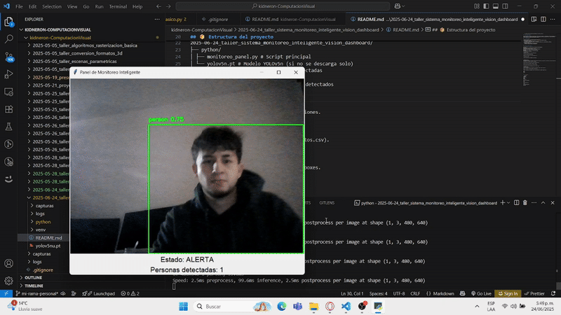

# 🧠 Taller - Mini-Sistema de Monitoreo Inteligente con Visión Artificial

## 🎯 Descripción general

Este sistema permite monitorear en tiempo real lo que ocurre frente a la cámara usando visión por computador. Se detectan personas con ayuda del modelo YOLOv5, se visualizan estadísticas en pantalla y se registran eventos automáticamente en archivos CSV y capturas de imagen.


### 🔍 Objetivo del taller

Diseñar un sistema de monitoreo inteligente que integre visión por computador (detección de personas u objetos) y un panel visual en tiempo real que permita observar lo que ocurre frente a la cámara. Además, se implementará la capacidad de generar logs o capturas automáticas según eventos definidos.


### 🔍 ¿Cómo funciona?

- Se activa la cámara y se analiza el video en tiempo real.
- Se usa el modelo `YOLOv5n` de la librería `ultralytics` para detectar objetos.
- Si se detecta una persona:
  - Se guarda una captura de la imagen con timestamp.
  - Se escribe un log en formato CSV con los datos del evento (hora, clase detectada, confianza).
- Se muestra un panel con:
  - Conteo en tiempo real de personas detectadas.
  - Estado del sistema (Inactivo / Detectando).

---

## 📦 Estructura del proyecto

```
2025-06-04_taller_sistema_monitoreo_inteligente_vision_dashboard/
├── python/
│ ├── monitoreo_panel.py # Script principal
│ └── yolov5n.pt # Modelo YOLOv5n (si no se descarga solo)
├── capturas/ # Capturas de personas detectadas
├── logs/
│ └── eventos.csv # Registros de eventos detectados
├── README.md
```


## 📊 Visualización

✅ Ventana en tiempo real con las detecciones.

✅ Contador de personas detectadas.

✅ Registro en tiempo real (archivo eventos.csv).


## 📁 Evidencias (GIFs)

🎥 GIF del monitoreo en tiempo real con boxes.




## 🔹 Fragmento de código relevante:

```python
def actualizar_frame():
    ret, frame = cap.read()
    if not ret:
        return

    detecciones = model(frame)[0]
    personas = 0

    for r in detecciones.boxes:
        cls_id = int(r.cls)
        conf = float(r.conf)
        label = model.names[cls_id]

        if label == 'person' and conf > 0.5:
            personas += 1
            timestamp = datetime.now().strftime("%Y-%m-%d_%H-%M-%S")
            img_path = f"../capturas/captura_{timestamp}.jpg"
            cv2.imwrite(img_path, frame)
            with open(log_path, "a") as f:
                f.write(f"{timestamp},Persona detectada,{label},{conf:.2f}\n")

        # Dibujar cajas
        xyxy = r.xyxy[0].cpu().numpy().astype(int)
        cv2.rectangle(frame, (xyxy[0], xyxy[1]), (xyxy[2], xyxy[3]), (0, 255, 0), 2)
        cv2.putText(frame, f"{label} {conf:.2f}", (xyxy[0], xyxy[1] - 10),
                    cv2.FONT_HERSHEY_SIMPLEX, 0.5, (0, 255, 0), 2)

    # Actualizar UI
    estado = "ALERTA" if personas > 0 else "Inactivo"
    estado_label.config(text=f"Estado: {estado}")
    conteo_label.config(text=f"Personas detectadas: {personas}")

    # Mostrar imagen en panel
    rgb_frame = cv2.cvtColor(frame, cv2.COLOR_BGR2RGB)
    img = Image.fromarray(rgb_frame)
    imgtk = ImageTk.PhotoImage(image=img)
    video_label.imgtk = imgtk
    video_label.configure(image=imgtk)

    root.after(100, actualizar_frame)
```


---


## 👥 Integrantes

- Sebastián Muñoz → jumunozle@unal.edu.co
- Carlos Camacho → cacamacho@unal.edu.co  
- Juan Daniel Ramírez → juaramriezmo@unal.edu.co
- Sergio David López → slopezpa@unal.edu.co


---

## Reflexión final
Este sistema cumple con lo esencial de un sistema de vigilancia: detección, visualización y registro automático. Para hacerlo más robusto se podrían integrar:

-Detección de múltiples clases con acciones diferentes.

-Panel gráfico más avanzado con Dash o Tkinter.

-Notificaciones automáticas por correo o sonido.

-Implementación remota (dashboard web o servidor Flask).

##  Prompts usados

- “Crear script de detección de personas con YOLOv5 y guardar logs y capturas.”

- “Mostrar contador en vivo y generar archivo CSV.”

- “Adaptar código para entrega del taller con estructura de carpetas específica.”


