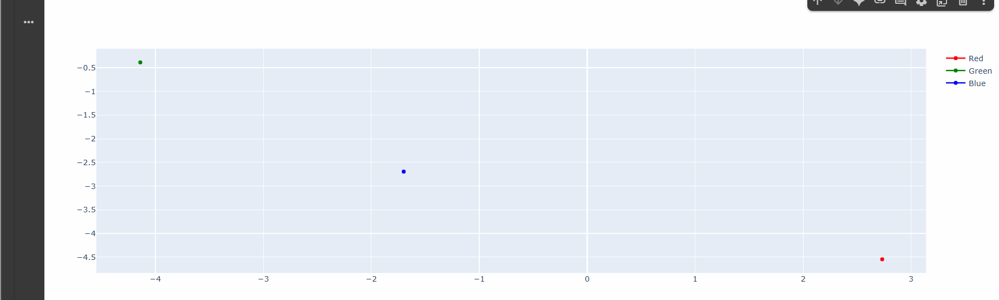

# 🧪 WebSockets e Interacción Visual en Tiempo Real

## 📅 Fecha

2025-06-04 – Fecha de asignación

2025-06-23 – Fecha de realización

2025-06-24 – Fecha de entrega

---

## 🎯 (Parte 1) Explicación breve de WebSockets.
WebSockets es una tecnología que permite una comunicación bidireccional y en tiempo real entre un cliente (como un navegador web) y un servidor, usando una única conexión TCP persistente.

**Características clave:**

- Tiempo real: ideal para chats, juegos en línea, actualizaciones en vivo, etc.

- Bidireccional: tanto el cliente como el servidor pueden enviar mensajes en cualquier momento.

- Persistente: no necesita abrir una nueva conexión para cada mensaje como HTTP.

- Menor sobrecarga: reduce la necesidad de enviar encabezados repetidos como en HTTP.

---

## 🧠 (Parte 2) GIFs animados

> ✅ En el siguiente GIF se como el servidor envia informacion en tiempo real que se carga y el grafico se va a dibujar poco a poco gracias a la info que envai el server al colab.



---

## 🔧 (Parte 3) Código relevante (C#, JSX/GLSL o JS para geometría).

A continuación se muestra el código para el servidor comentado. 

```C#
# Importa la biblioteca asyncio para manejar programación asíncrona (tareas concurrentes).
import asyncio

# Importa la biblioteca websockets para crear servidores y clientes WebSocket.
import websockets

# Importa json para convertir datos en formato JSON (texto) antes de enviarlos.
import json

# Importa random para generar números y colores aleatorios.
import random

# Define una función asíncrona que manejará la conexión con cada cliente WebSocket.
async def handler(websocket):
    while True:  # Bucle infinito para enviar datos constantemente
        # Crea un diccionario con valores aleatorios para simular datos en tiempo real.
        data = {
            "x": random.uniform(-5, 5),  # Valor aleatorio entre -5 y 5 para 'x'
            "y": random.uniform(-5, 5),  # Valor aleatorio entre -5 y 5 para 'y'
            "color": random.choice(["red", "green", "blue"])  # Color aleatorio
        }
        # Convierte el diccionario a una cadena JSON y lo envía al cliente.
        await websocket.send(json.dumps(data))

        # Espera 0.5 segundos antes de enviar el siguiente mensaje.
        await asyncio.sleep(0.5)

# Define la función principal que inicia el servidor WebSocket.
async def main():
    # Crea un servidor WebSocket en localhost, puerto 8765, y usa la función handler para manejar las conexiones.
    async with websockets.serve(handler, "localhost", 8765):
        # Espera indefinidamente (hasta que se cierre el servidor).
        await asyncio.Future()

# Ejecuta el servidor llamando a la función principal.
asyncio.run(main())

```

---

## 👥 Integrantes
- Sebastián Muñoz → jumunozle@unal.edu.co
- Carlos Camacho → cacamacho@unal.edu.co  
- Juan Daniel Ramírez → juaramriezmo@unal.edu.co
- Sergio David López → slopezpa@unal.edu.co 

---

