# Taller Práctico – Detección, Segmentación y Profundidad con YOLO + SAM + MiDaS

## 👥 Integrantes

- Sebastián Muñoz → jumunozle@unal.edu.co
- Carlos Camacho → cacamacho@unal.edu.co  
- Juan Daniel Ramírez → juaramriezmo@unal.edu.co
- Cristian Medina → crmedinab@unal.edu.co 
----------

## 🧠 Introducción

En el auge de la inteligencia artificial, el aprendizaje profundo se ha consolidado como una herramienta indispensable para el análisis de imágenes y el reconocimiento de patrones. Entre sus múltiples vertientes, las redes neurales convolucionales (CNN) se han destacado por ofrecer soluciones eficientes y de alto rendimiento en tareas de visión por computadora, como el reconocimiento de dígitos, la detección de objetos o el análisis médico de radiografía, entre otras.

En esta práctica hemos analizado un notebook, el cual trabaja con el conjunto de datos MNIST. Este conjunto consta de imágenes en escala de grises que representan dígitos manuscritos del 0 al 9, y se considera un ejemplo clásico para el aprendizaje automático. A partir de dicho notebook, hemos examinado paso a paso el flujo de procesamiento de los datos, la construcción del modelo, el entrenamiento, la evaluación y, finalmente, la exportación del modelo para que pueda ser utilizado en otras plataformas.

Este análisis proporciona tanto una comprensión teórica como práctica del funcionamiento de las redes neurales convolucionales, así como de las diferentes fases involucradas en el pipeline de un modelo de deep learning destinado al reconocimiento de dígitos. Además, el procedimiento que hemos revisado puede ser un modelo de referencia para implementar soluciones más complejas o adaptadas a nuevos tipos de datos en el taller.

En el notebook que hemos inspeccionado se implementa una Convolutional Neural Network (CNN) utilizando TensorFlow para llevar a cabo el reconocimiento de dígitos manuscritos. Una CNN es un algoritmo de aprendizaje profundo capaz de tomar una imagen como entrada, asignarle pesos y sesgos a varias regiones de esta, y así aprender a distinguir un dígito de otro de forma autónoma.

Este modelo fue implementado utilizando TensorFlow junto con otras librerías como Matplotlib (para la gráfica de resultados), Seaborn (para la matriz de confusión), NumPy (para las operaciones matemáticas), Pandas (para manipular los datos) y datetime (para llevar el seguimiento de los entrenamientos).

Este análisis permitirá tener una comprensión más clara tanto del flujo de datos, el diseño del modelo, el procedimiento de entrenamiento y evaluación, así como de las estrategias utilizadas para guardar el modelo y llevar a producción soluciones de reconocimiento de dígitos.

----------

## *✒️ Parte 1 - Análisis paso a paso del flujo*

En esta sección describiremos el flujo del modelo de red neuronal convolucional utilizado para clasificar dígitos manuscritos. A lo largo de cada paso, se presentará cómo se manipulan los datos, cómo se construye el modelo y cómo se entrena y evalúa, ayudándonos así a entender el funcionamiento de esta aplicación de la inteligencia artificial y su relevancia en la materia de Computación Visual.

----------

### Importar dependencias

El primer paso realizado en el notebook es la importación de varias librerías y dependencias necesarias para llevar a cabo el flujo de trabajo. A continuación se mencionan las librerías y sus usos:

- TensorFlow se utiliza para desarrollar y entrenar el modelo de red neuronal convolucional.
- Matplotlib proporciona las herramientas para crear gráficas que muestran el progreso del entrenamiento.
- Seaborn se encarga de dibujar la matriz de confusión, ayudándonos así a entender el rendimiento del modelo.
NumPy proporciona una estructura de datos eficiente para manipular los tensores y realizar cálculos numéricos.
- Pandas nos permitirá organizar e inspeccionar tanto los datos de entrenamiento como los resultados.
Math se utiliza para llevar a cabo algunos cálculos matemáticos específicos.
- Datetime se encarga de crear nuevos nombres de carpetas para guardar los resultados de cada ejecución, facilitando así el seguimiento de los experimentos.

----------

### Configurar Tensorboard

A continuación, se configura Tensorboard, que nos permitirá inspeccionar el progreso del entrenamiento y depurar el modelo si así lo necesitamos. Primero se carga la extensión de Tensorboard en el notebook y luego se eliminan los registros anteriores para evitar confusiones y así guardar nuevos resultados más claros y organizados.

-----------

### Carga de datos MNIST

En esta sección se cargó el conjunto de datos MNIST, que consta de 60,000 imágenes de dígitos manuscritos para el entrenamiento y 10,000 para la prueba.
Cada imagen tiene un tamaño de 28x28 píxeles en escala de grises.
Este conjunto de datos se utiliza habitualmente como referencia para el aprendizaje automático en el análisis de imágenes.

------------

### Explorar los datos

El conjunto de datos utilizado en este experimento es el famoso MNIST, el cual contiene imágenes de dígitos manuscritos del 0 al 9. En total, se incluyen 60.000 imágenes para entrenamiento y 10.000 imágenes para prueba, todas en escala de grises y con una resolución de 28×28 píxeles.

Antes de cualquier operación, se inspeccionan las dimensiones de los conjuntos de entrenamiento y prueba:

```
print(x_train.shape)  # (60000, 28, 28)
print(y_train.shape)  # (60000,)
```

Esto confirma que el conjunto de entrenamiento tiene 60.000 imágenes de 28x28 píxeles, con una etiqueta por imagen.
Se grafican múltiples imágenes de ejemplo por clase para observar la diversidad de la escritura manuscrita:

```
import matplotlib.pyplot as plt
fig, axes = plt.subplots(1, 10, figsize=(15, 4))
for i in range(10):
    idx = y_train.tolist().index(i)
    axes[i].imshow(x_train[idx], cmap='gray')
    axes[i].set_title(f"Label: {i}")
    axes[i].axis("off")
plt.show()
```

Este gráfico permite ver al menos una imagen representativa por cada clase del 0 al 9.
También se construye un histograma de la frecuencia de cada etiqueta en el conjunto de entrenamiento

 ### Observaciones

 - La distribución de clases es relativamente uniforme, lo cual es ideal para entrenamiento supervisado.

 - Esto sugiere que el modelo no tendrá un sesgo inicial hacia clases mayoritarias.

 -----------

 ## Reshape de los datos

 A continuación, se lleva a cabo el reshape de los datos para adaptarlos a la estructura esperada por las redes neuronales convolucionales. Originalmente, cada dígito tiene una forma de (28, 28), que corresponde a una matriz en escala de grises. Al remodelarlos a (28, 28, 1), se añade un canal, aumentando así la dimensionalidad de los datos y dejándolos preparados para que el modelo pueda procesarlos, de forma similar a como trabajaría con imágenes en color (RGB).

 ```
 x_train_with_chanels = x_train.reshape(
    x_train.shape[0],
    IMAGE_WIDTH,
    IMAGE_HEIGHT,
    IMAGE_CHANNELS
)

x_test_with_chanels = x_test.reshape(
    x_test.shape[0],
    IMAGE_WIDTH,
    IMAGE_HEIGHT,
    IMAGE_CHANNELS
)
 ```
----------

## Normalización de datos

Posteriormente, se lleva a cabo la normalización de los datos para llevar los valores de los píxeles, que están en el rango [0…255], al rango [0…1]. Esto se hace dividiendo cada píxel por 255. La normalización proporciona una base más adecuada para el entrenamiento del modelo, facilitando que el algoritmo pueda aprender de ellos de forma más estable y eficaz.

```
x_train_normalized = x_train_with_chanels / 255
x_test_normalized = x_test_with_chanels / 255
```
-----------

## Construcción del modelo

A continuación, se construye el modelo de redes neurales convolucionales (CNN) utilizando Keras. Primero se añade una capa Conv2D para extraer características de las imágenes, seguida de una capa de MaxPooling2D para resumir la información espacial. Esto se vuelve a repetir con un nuevo bloque de convolución y pooling. Posteriormente, se aplana la información en un vector con Flatten y se añade una capa densa totalmente conectada junto con un Dropout para prevenir el overfitting. Finalmente, el modelo proporciona una capa densa de 10 neuronas con activación softmax, donde cada neurona representa la probabilidad de que la imagen pertenezca a un dígito del 0 al 9.

```
model = tf.keras.models.Sequential()

model.add(tf.keras.layers.Convolution2D(
    input_shape=(IMAGE_WIDTH, IMAGE_HEIGHT, IMAGE_CHANNELS),
    kernel_size=5,
    filters=8,
    strides=1,
    activation=tf.keras.activations.relu,
    kernel_initializer=tf.keras.initializers.VarianceScaling()
))

model.add(tf.keras.layers.MaxPooling2D(
    pool_size=(2, 2),
    strides=(2, 2)
))

model.add(tf.keras.layers.Convolution2D(
    kernel_size=5,
    filters=16,
    strides=1,
    activation=tf.keras.activations.relu,
    kernel_initializer=tf.keras.initializers.VarianceScaling()
))

model.add(tf.keras.layers.MaxPooling2D(
    pool_size=(2, 2),
    strides=(2, 2)
))

model.add(tf.keras.layers.Flatten())

model.add(tf.keras.layers.Dense(
    units=128,
    activation=tf.keras.activations.relu
));

model.add(tf.keras.layers.Dropout(0.2))

model.add(tf.keras.layers.Dense(
    units=10,
    activation=tf.keras.activations.softmax,
    kernel_initializer=tf.keras.initializers.VarianceScaling()
))
```
A continuación, se genera un esquema visual del modelo utilizando tf.keras.utils.plot_model. Esta gráfica nos proporciona una representación de la estructura de la red neuronal, mostrando las distintas capas, sus nombre y las formas de sus salidas. Esto resulta útil para entender cómo fluye la información a lo largo del modelo.

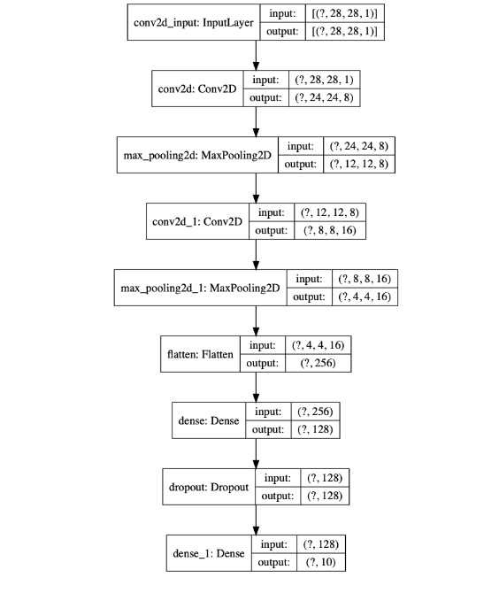

--------------

## Compilar el Modelo

Después de definir la arquitectura de la red neuronal convolucional (CNN), se compila el modelo para especificar cómo se entrenará. Se utiliza la función de pérdida categorical_crossentropy, adecuada para clasificación multiclase con etiquetas codificadas en one-hot. Como optimizador se emplea Adam con una tasa de aprendizaje de 0.01, y la métrica elegida es accuracy. El modelo tiene aproximadamente 197 855 parámetros entrenables, según el resumen (model.summary()).

---------------

## Entrenar el Modelo

A continuación, entrenamos el modelo utilizando el conjunto de datos de entrenamiento. Durante el entrenamiento, el modelo va ajustando sus pesos para minimizar el error, aumentando así tanto la exactitud como la capacidad de generalización. Como podemos notar en el histórico, a lo largo de las 10 epochs tanto la exactitud en entrenamiento como en validación muestran una mejora constante, alcanzando una exactitud de más del 99%. Esto significa que el modelo ha aprendido de forma adecuada a distinguir los dígitos manuscritos.

----------------

## Análisis de la evolución de la pérdidas y exactitud

En las dos gráficas podemos notar el progreso tanto de la pérdidas (loss) como de la exactitud (accuracy) a lo largo de las epochs de entrenamiento. La primera gráfica revela que el modelo comenzó con una pérdidas relativamente alta y fue disminuyendo de forma constante hasta estabilizarse hacia el final del entrenamiento, tanto en el conjunto de entrenamiento como en el de prueba. Esto significa que el modelo fue aprendiendo a realizar mejores predicciones sin caer en un sobreajuste. Por otro lado, en la gráfica de exactitud podemos ver que el modelo aumentó de forma gradual el número de predicciones correctas, alcanzando una exactitud cercana al 99%. La exactitud tanto en el conjunto de entrenamiento como en el de prueba muestran una progresión muy similar, lo que indica que el modelo generaliza adecuadamente y que el aprendizaje fue efectivo.

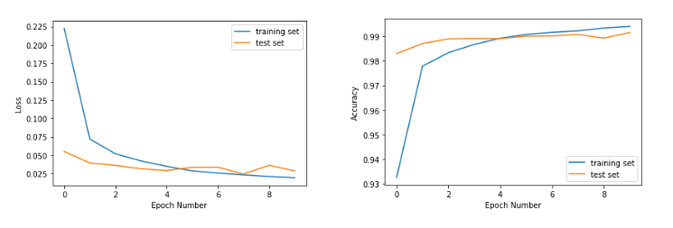

------------------

## Evaluar el modelo

Al finalizar el entrenamiento, podemos notar que el modelo alcanzó una exactitud muy alta tanto en el conjunto de entrenamiento como en el de prueba. La exactitud en el conjunto de entrenamiento fue de 0.9974, mientras que en el conjunto de prueba fue de 0.9916. Esto significa que el modelo generaliza muy bien y que el overfitting es mínimo, ya que la caída en el rendimiento del conjunto de prueba frente al de entrenamiento es relativamente pequeña. La pérdidas muestran el mismos fenómeno: el modelo tiene una pérdidas de 0.0079 en el conjunto de entrenamiento y de 0.0286 en el conjunto de prueba, sin que el incremento sea alarmante. Esto revela que el modelo ha aprendido de forma adecuada sin dejar de ser capaz de funcionar con nuevos datos.

```
Training loss:  0.00793841718863229
Training accuracy:  0.9974

Validation loss:  0.028636791965250815
Validation accuracy:  0.9916
```

------------

## Guardar el modelo

Una vez que el modelo ha sido entrenado y evaluado, se procede a guardar para poder reusearlo posteriormente. Esto se hace guardándalo en un archivo HDF5 con extensión .h5. Este formato HDF5 conserva tanto la estructura de la red neuronal como los pesos aprendidos. Posteriormente, el modelo se puede convertir, utilizando tensorflowjs_converter, para que pueda ser utilizado directamente en el front-end en forma de un modelo compatible con TensorFlow.js.

## Usar el modelo (hacer predicciones)

El modelo entrenado se utilizó para hacer predicciones sobre los datos de prueba (x_test_normalized). La salida fue una matriz de probabilidades (shape: (10000, 10)), donde cada fila representa la probabilidad de cada dígito del 0 al 9.
Se eligió la clase con mayor probabilidad para cada imagen:
predictions = np.argmax(predictions_one_hot, axis=1)

Al visualizar los resultados, se comprobó que el modelo reconoce correctamente la mayoría de los dígitos, como se observa en la comparación entre predicción y etiqueta real (verde = correcta, rojo = incorrecta).

## Crear una matriz de confusión

La matriz de confusión se utiliza para analizar en profundidad el rendimiento del modelo, mostrando cuántos aciertos y errores tiene para cada una de las clases. Esto significa que podemos saber, por ejemplo, si el modelo suele confundir un número con otro, o si tiene una tasa de aciertos muy alta en determinados dígitos.

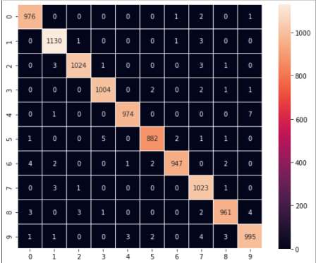

En la imagen podemos notar que el modelo clasifica correctamente la mayoría de las muestras (la diagonal más luminosa), pero en algunos casos puede confundir un dígito con otro (por ejemplo, el 5 con el 3 o el 2 con el 3). Así podemos tener una visión más detallada de sus fortalezas y debilidades, lo cual resulta muy útil para tomar medidas de mejora si así se requiere.

-----------------

## Depuración del modelo con TensorBoard

TensorBoard es una herramienta muy útil para dar seguimiento y analizar el entrenamiento de un modelo de redes neurales. A partir de los registros generados, se puede inspeccionar métricas como la exactitud, la pérdidas, el progreso epoch a epoch, así como otros parámetros internos del modelo. También proporciona una representación gráfica que ayuda a detectar problemas de overfitting, estancamientos o falta de generalización.

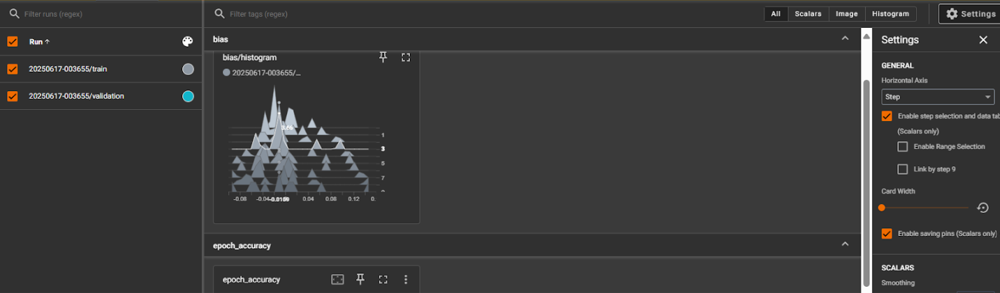
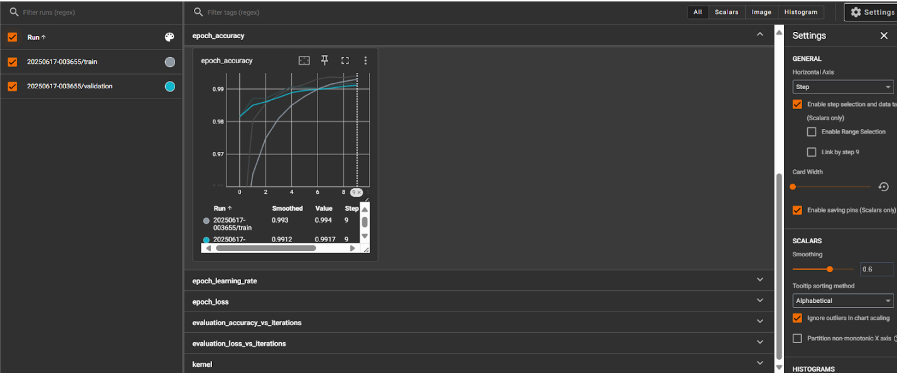

En la imagen se puede ver el panel de TensorBoard, que muestra tanto la exactitud en el conjunto de entrenamiento como en el de validación a lo largo de varias epochs. Esto proporciona una forma visual e interactiva de entender el aprendizaje de la red y guiar así el ajuste de sus hiperparámetros o de su estructura si fuese necesario.

--------------

## Convertir el modelo para la web

Para poder usar el modelo en una aplicación web necesitamos convertirlo al formato compatible con TensorFlow.js. Esto se logra con tensorflowjs_converter. Así podemos llevar el modelo ya entrenado directamente al navegador y demostrar cómo funciona en tiempo real.

## *Lo aprendido - Parte 1*

En esta práctica aprendimos el flujo básico para entrenar una red neuronal convolucional (CNN) para clasificar dígitos de la base de datos MNIST. Un paso importante fue el preprocesamiento de los datos: el reshape nos ayudó a dar a las imágenes el número de dimensiones que el modelo espera, mientras que la normalización se encargó de llevar los valores de los píxeles a un rango de 0 a 1, aumentando así la estabilidad del entrenamiento. También descubrimos cómo el modelo mejora en cada epoch, cómo podemos guardar el modelo ya entrenado y cómo convertir dicho modelo para que pueda funcionar directamente en un navegador.

-------------------

## Cómo podrían aplicar ideas de ese notebook al taller actual

Lo que aprendimos aquí se puede aplicar directamente al taller de detección, segmentación y estimación de profundidad. Así como nosotros trabajamos con un modelo para clasificar dígitos, el taller se enfrenta a retos y tareas de análisis de imágenes: detectar objetos con YOLO, segmentarlos con SAM y luego estimar sus profundidades con MiDaS. La estructura del flujo —carga de datos, preprocesado, construcción del modelo, evaluación y aplicación— sigue el mismos esquema, pero adaptado a un problema más complejo y más visual. Esto permitirá implementar soluciones más avanzadas, como el pixelado del fondo, el análisis de proximidad o el conteo de objetos según distancia.

----------------

## *Parte 2 Uso de herramientas*

En primer lugar, se llevó a cabo la detección de objetos en la imagen utilizando YOLOv8n. Como resultado, el modelo identificó varias instancias en la escena, incluido un bus, varias personas, un Transmilenio y un camión.

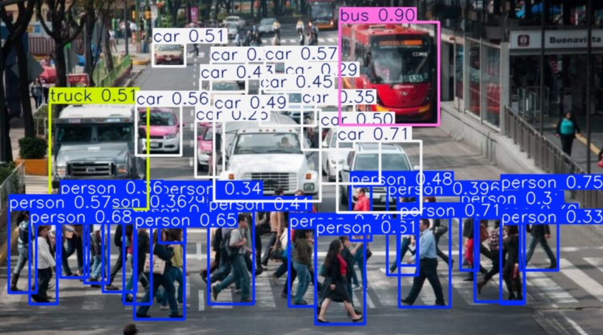

Imagen de entrada → Detección de Objetos (YOLOv8n) → Segmentación (SAM) → Estimación de Profundidad (MiDaS) → Análisis Visual o Cuantitativo

----------------

## Explicación de cada modelo

- YOLOv8n: se encarga de detectar los objetos presentes en la imagen, dibujándoles un bounding box.

- SAM (Segment Anything Model): a partir de los bounding boxes de la detección, el modelo genera una máscara más precisa de cada objeto, aislándolos del fondo.

- MiDaS: proporciona un mapa de profundidad de la escena, que permitirá distinguir cuán cerca o lejos están los diferentes elementos presentes en ella.

## Análisis visual o cuantitativo

Tras aplicar MiDaS, podemos extraer, por ejemplo, la profundidad media de cada objeto detectado. Esto resulta útil para determinar la proximidad de los objetos a la cámara, distinguir grupos o priorizar el análisis de elementos específicos.

Según el procedimiento realizado, el bus se encontraba más lejos que las personas en primer plano. Este aspecto se analizará más adelante con énfasis en el mapa de calor, el cual permite visualizar este tipo de análisis con mayor claridad.

Aunque el modelo logra separar casi todas las personas en primer plano, se observan limitaciones al distinguir algunas figuras superpuestas en el fondo, especialmente cuando solo son visibles pequeñas porciones de estas (menos del 15% del cuerpo). Un ejemplo claro es el niño ubicado detrás de la señora de blanco, en la parte izquierda de la imagen.

Además, mientras el sistema detecta uno de los autos en el fondo, no logra identificar otro situado aún más atrás, donde se confunde con la multitud. Esta limitación se debe, en parte, a la escasa información visual disponible para una segmentación precisa.

--------

## Conversión de Bounding Box a Máscara de Segmentación

Una vez detectados los objetos con YOLOv8n, se procede a convertir cada bounding box en una máscara de segmentación más precisa utilizando SAM. A partir de las cajas delimitantes, el modelo genera una máscara binaria que destaca el objeto frente al fondo. Posteriormente, esta máscara se combina con la imagen original para crear una versión aislada de cada objeto, facilitando así tanto el análisis como el procesamiento posterior. Esto proporciona una representación más exacta de la forma y el contorno de cada elemento de interés en la escena.

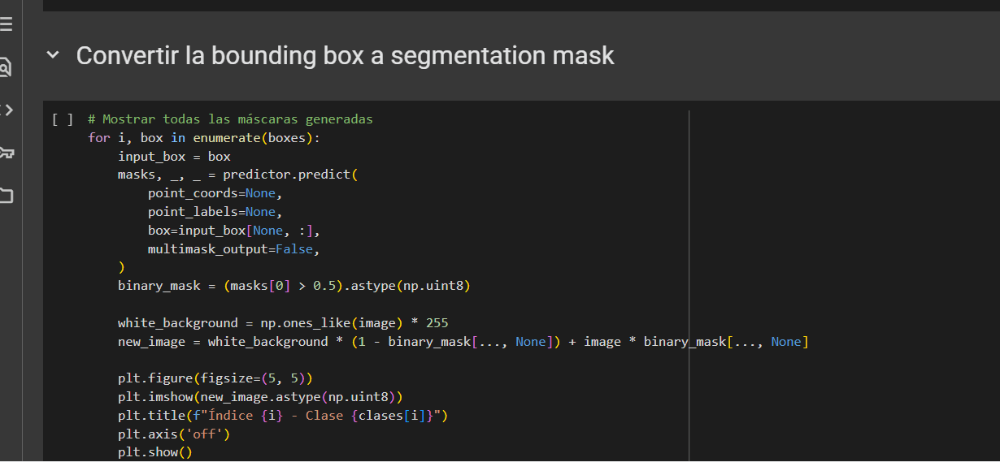

---------

## Aplicación de la Máscara de Segmentación

Una vez obtenida la máscara de segmentación, esta se umbraliza para crear una máscara binaria, en la que los píxeles que pertenecen al objeto muestran un 1 y el resto un 0. A partir de esta máscara, se genera una versión modificada de la imagen original, combinándola con un fondo blanco. Así, el objeto segmentado queda aislado y resaltado frente al resto de la escena, facilitando tanto el análisis como el procesamiento posterior de cada elemento de interés.

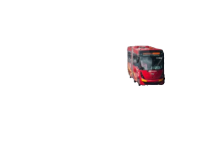

------------

## Aplicación de MiDaS para Estimación de Profundidad

MiDaS proporciona una estimación de profundidad a partir de una imagen RGB, sin necesitar información 3D ni estereoscópica. Primero, se carga el modelo MiDaS (DPT Large) junto con sus transformaciones de entrada. La imagen se redimensionaliza y normaliza según el modelo, y posteriormente MiDaS genera un mapa de profundidad en forma de matriz, donde cada pixel representa cuán lejos o cerca se encuentran los objetos en la escena. Finalmente, el resultado se visualiza como un mapa de calor en escala de grises, aumentando así nuestra comprensión de la estructura espacial de los elementos presentes en la imagen.

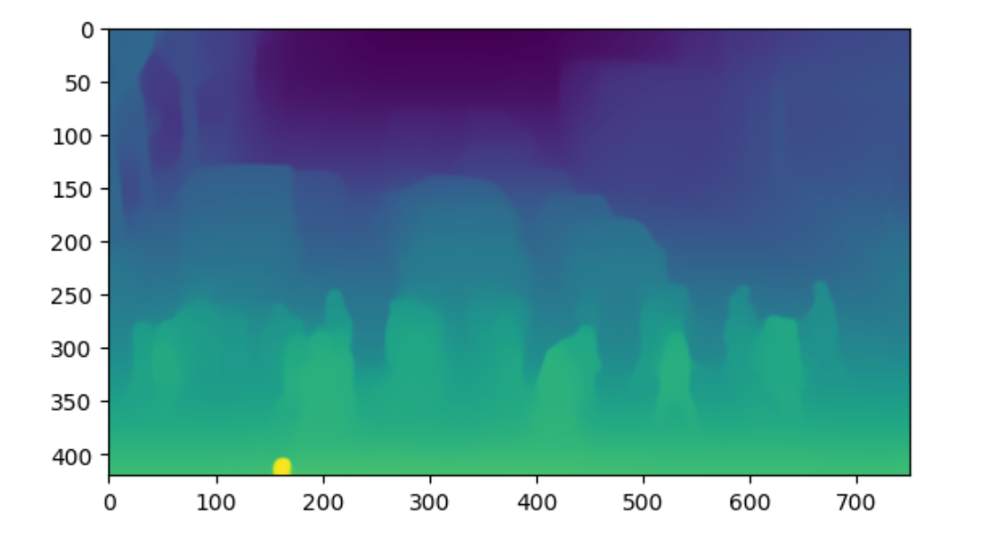

----------

## Comparativa de resultados

En esta comparativa podemos notar el flujo del pipeline implementado. A la izquierda vemos la detección de objetos junto con sus cajas delimitantes (YOLO) y la máscara de segmentación (SAM) que aísla el objeto de interés en la escena. En el centro podemos apreciar el objeto ya segmentado sobre un fondo blanco, resaltando así sus contornos y sin interferencias del entorno. Finalmente, a la derecha se presenta el mapa de profundidad obtenido con MiDaS, que proporciona una representación de las distancias de los elementos en la imagen; las regiones más cálidas muestran los objetos más cercanos, mientras que las más frías muestran los que están más lejos. Así, esta comparación revela cómo cada paso proporciona información complementaria para el análisis de la escena.

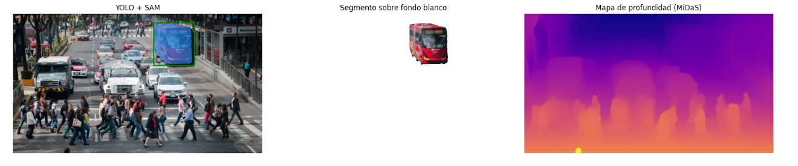

En esta parte se implementó un desenfoque del fondo para destacar el objeto principal en la escena. Esto se logra primero desenfocando toda la imagen con un filtro gaussiano y luego combinándola con la máscara de segmentación, de modo que el objeto permanece nítido mientras que el fondo aparece borroso. Así, podemos resaltar las regiones de interés, facilitar el análisis visual y concentrar nuestra atención en lo que resulta más relevante para el procedimiento. La simulación de bokeh significa imitar el efecto bokeh que se logra en la fotografía profesional, en el cual el sujeto principal aparece nítido y el fondo se vuelve borroso o desenfocado. Esto atrae más la atención hacia el objeto que nos interesa —por ejemplo, el coche, el bus o la persona— y proporciona una estética más agradable y concentrada en el sujeto de la imagen.

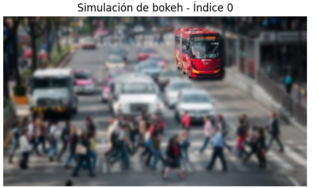

--------------

## Reflexión sobre posibles usos de esta combinación

La combinación de detección de objetos, segmentación, estimación de profundidad y desenfoque del fondo proporciona una herramienta muy versátil para el análisis visual, tanto en entornos específicos como en contextos más creativos. Por ejemplo, en seguridad, esta aplicación puede usarse para destacar intrusiones, concentrar el seguimiento en determinados sujetos o regiones de interés, o implementar nuevos mecanismos de vigilancia más eficientes, aumentando así el control de espacios específicos sin dejar de tener una perspectiva general de lo que ocurre.

Además, en el campo de la realidad aumentada el pipeline permitirá crear experiencias más envolventes y realistas, ya que podemos distinguir los diferentes planos de la escena y manipularlos de forma independiente. Esto proporciona una base muy adecuada para implementar nuevos tipos de interacciones, desde destacar un producto en un catálogo hasta proporcionar guías visuales en el mantenimiento de maquinaria, aumentando así el valor agregado de las soluciones. Por último, en el arte y el diseño, esta técnica proporciona nuevos espacios de expresión, ayudando a los creadores a dar énfasis a determinados elementos, modificarlos, o aplicar efectos estéticos específicos que atraigan la atención del espectador hacia lo que más importa en cada composición.


 