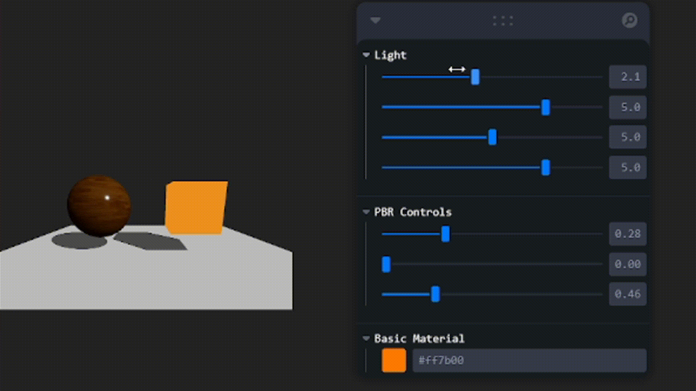

🧪 Taller - Materiales Realistas: Introducción a PBR en Unity y Three.js

📅 Fecha
2025-05-31 – Fecha de entrega

🎯 Objetivo del Taller
Explorar los principios del renderizado basado en física (PBR) y aplicarlos a modelos 3D para mejorar su realismo visual, comparando cómo la luz interactúa con diferentes tipos de materiales y cómo las texturas afectan el resultado final.

🧠 Conceptos Aprendidos
- Fundamentos de Physically-Based Rendering (PBR)
- Uso de mapas de texturas (albedo, roughness, normal)
- Interacción luz-material en gráficos 3D
- Configuración de materiales en Three.js/React Three Fiber
- Controles interactivos para ajuste en tiempo real

🔧 Herramientas y Entornos
- Three.js con React Three Fiber
- Leva para controles interactivos
- @react-three/drei para utilidades
- Visual Studio Code como editor

📁 Estructura del Proyecto
2025-05-31_taller_materiales_pbr_threejs/
├── threejs/
│   ├── public/textures/ (albedo.jpg, normal.jpg, roughness.jpg)
│   └── src/App.js
├── resultados/
│   ├── resultados_basicos.gif
└── README.md

🧪 Implementación

🔹 Etapas realizadas
1. Configuración de escena básica con luces y geometrías
2. Carga de texturas PBR (albedo, normal, roughness)
3. Implementación de MeshStandardMaterial con mapas PBR
4. Creación de controles interactivos con Leva
5. Comparación con material básico (MeshBasicMaterial)

🔹 Código relevante
## 🔹 Código Relevante

```jsx
import { useControls } from 'leva';
import { useTexture } from '@react-three/drei';

// Componente principal PBR
function PBRObject() {
  // Carga de texturas
  const [albedo, normal, roughness] = useTexture([
    '/textures/albedo.jpg',
    '/textures/normal.jpg', 
    '/textures/roughness.jpg'
  ]);

  // Controles interactivos
  const controls = useControls({
    roughness: { value: 0.5, min: 0, max: 1 },
    metalness: { value: 0, min: 0, max: 1 },
    normalScale: { value: 1, min: 0, max: 2 }
  });

  return (
    <mesh>
      <sphereGeometry args={[1, 64, 64]} />
      <meshStandardMaterial
        map={albedo}
        normalMap={normal}
        roughnessMap={roughness}
        {...controls}
      />
    </mesh>
  );
}

// Configuración de luces
<directionalLight
  intensity={1}
  position={[5, 5, 5]}
  castShadow
  shadow-mapSize={[2048, 2048]}
/>
// Configuración de material PBR
<meshStandardMaterial
  map={albedo}
  normalMap={normal}
  roughnessMap={roughness}
  roughness={controls.roughness}
  metalness={controls.metalness}
/>

// Controles interactivos
useControls('PBR Controls', {
  roughness: { value: 0.5, min: 0, max: 1 },
  metalness: { value: 0, min: 0, max: 1 }
})

Puntos clave del código:

-Uso de useTexture para carga optimizada de texturas

-Integración con Leva para controles en tiempo real

-Configuración completa de sombras

-Parámetros PBR esenciales (roughness, metalness)

-Geometría detallada (64 segmentos)

Comparación Materiales PBR vs Básico



Características demostradas:

Efecto de roughness en reflejos

Influencia del normal map en detalles superficiales

Diferencia visual con material básico (color plano)

Interacción dinámica con la luz

🧩 Prompts Usados
"Configura un sistema de controles interactivos para materiales PBR en Three.js"
"Crea una comparación visual entre MeshStandardMaterial y MeshBasicMaterial"

💬 Reflexión Final
Este taller me permitió comprender en profundidad cómo los materiales PBR simulan el comportamiento físico de la luz, especialmente a través del uso combinado de mapas de texturas. La parte más interesante fue observar cómo pequeños ajustes en los valores de roughness y metalness producían cambios significativos en la apariencia final.

La implementación de controles interactivos resultó fundamental para experimentar rápidamente con diferentes configuraciones. En futuros proyectos, me gustaría explorar el uso de más mapas PBR como 