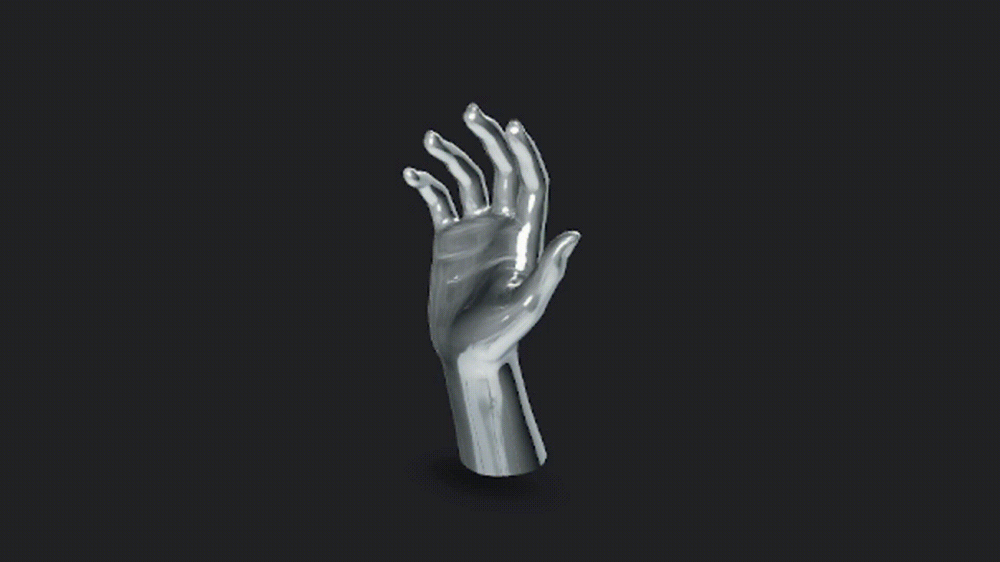

Taller - UV Mapping: Texturas que Encajan
📅 Fecha
2025-05-31 – Fecha de entrega

🎯 Objetivo del Taller
Explorar el mapeo UV como técnica fundamental para aplicar correctamente texturas 2D sobre modelos 3D sin distorsión. En este caso, se cargó un modelo .glb y se aplicaron texturas PBR manualmente para observar cómo afectan las coordenadas UV en la apariencia del modelo.

🧠 Conceptos Aprendidos
Transformaciones geométricas (escala, rotación, traslación)

Mapeo UV y texturizado PBR

Carga de modelos GLTF

Materiales físicos realistas (MeshStandardMaterial)

Iluminación en escenas 3D

Suspense y carga asíncrona en React

🔧 Herramientas y Entornos
Three.js / React Three Fiber

@react-three/fiber

@react-three/drei

three (core)

Editor de texto: VS Code

Navegador: Chrome / Firefox

Herramienta para grabar GIF: ScreenToGif

📁 Estructura del Proyecto
mathematica
Copiar
Editar
2025-05-31_taller_uv_mapping_texturas/
├── threejs/
│   ├── models/
│   │   └── female_hand.glb
│   ├── textures/
│   │   ├── Metal049A_2K-JPG_Color.jpg
│   │   ├── Metal049A_2K-JPG_NormalGL.jpg
│   │   ├── Metal049A_2K-JPG_Roughness.jpg
│   │   └── Metal049A_2K-JPG_Metalness.jpg
│   ├── resultados/
│   │   └── uv_mapping_resultado.gif
│   ├── App.jsx
│   └── ...
└── README.md
🧪 Implementación
🔹 Etapas realizadas
Carga del modelo .glb de una mano femenina usando useGLTF.

Carga de texturas PBR: mapa de color, normal, rugosidad y metalicidad.

Aplicación de las texturas al material mediante MeshStandardMaterial.

Iluminación realista y entorno Stage con luz ambiental y direccional.

Control de cámara con OrbitControls.

Corrección del error: El preset "soft" y "medical" no existen. Se reemplazaron por presets válidos ("city" o "studio") según la documentación de @react-three/drei.

🔹 Código relevante
jsx
Copiar
Editar
<Stage
  intensity={0.6}
  environment="city" // ← Cambiado desde "medical"
  adjustCamera={1.2}
  preset="studio" // ← Cambiado desde "soft"
>
  <Suspense fallback={null}>
    <HandModel />
  </Suspense>
</Stage>
📊 Resultados Visuales

📌 Este taller requiere explícitamente un GIF animado:

🧩 Prompts Usados
No se usaron prompts IA para este taller.
Todo el código fue desarrollado manualmente usando documentación oficial.

💬 Reflexión Final
Este taller me permitió entender a profundidad cómo las coordenadas UV afectan directamente la calidad del texturizado en modelos 3D. El uso de materiales PBR y texturas personalizadas evidenció cómo el modelo puede lucir realista solo si las UV están bien proyectadas.

El error que obtuve inicialmente fue causado por valores inválidos en el preset de entorno y luz ("soft" y "medical"), que no existen en la librería @react-three/drei. Reemplazarlos por valores válidos como "studio" y "city" solucionó completamente el problema. En proyectos futuros, planeo experimentar con más mapas (como AO o displacement) y explorar herramientas como Blender para editar las UV manualmente.